# Wazuh SIEM Home Lab: SOC Detection & Response Workflow

A home lab built around Wazuh as a SIEM. Covers manager deployment, Windows agent registration, real-time File Integrity Monitoring, Sysmon telemetry, attack simulation with Atomic Red Team, custom detection rules mapped to MITRE ATT&CK, native vulnerability detection, vulnerability-to-alert correlation, and incident reporting using the NIST Cybersecurity Framework.

---

## 📑 Table of Contents

- [Overview](#overview)
- [Lab Architecture](#lab-architecture)
- [Prerequisites](#prerequisites)
- [Setup](#setup)
  - [1. Install Wazuh Manager on Ubuntu](#1-install-wazuh-manager-on-ubuntu)
  - [2. Access the Wazuh Dashboard](#2-access-the-wazuh-dashboard)
  - [3. Install the Wazuh Agent on Windows](#3-install-the-wazuh-agent-on-windows)
  - [4. Register the Agent with the Manager](#4-register-the-agent-with-the-manager)
  - [5. Configure File Integrity Monitoring](#5-configure-file-integrity-monitoring)
  - [6. Set Up the Windows 11 VM (Attack Simulation Endpoint)](#6-set-up-the-windows-11-vm-attack-simulation-endpoint)
  - [7. Generate Attack Telemetry with Atomic Red Team](#7-generate-attack-telemetry-with-atomic-red-team)
  - [8. Write a Custom Detection Rule + MITRE ATT&CK Mapping](#8-write-a-custom-detection-rule--mitre-attck-mapping)
  - [9. Enable Native Vulnerability Detection](#9-enable-native-vulnerability-detection)
  - [10. Correlate Vulnerabilities with Detections](#10-correlate-vulnerabilities-with-detections)
  - [11. Incident Report (NIST CSF)](#11-incident-report-nist-csf)
- [Verifying the Setup](#verifying-the-setup)
- [Resources](#resources)

---

## Overview

This lab builds a working SOC pipeline covering:

- Wazuh Manager and Dashboard deployment on Ubuntu
- Windows agent registration and real-time File Integrity Monitoring (FIM)
- Sysmon deployment for high-fidelity Windows process telemetry
- Log forwarding from Sysmon into Wazuh
- Attack simulation using Atomic Red Team (MITRE ATT&CK T1033, System Owner/User Discovery)
- A custom Wazuh detection rule mapped directly to MITRE ATT&CK
- Native Wazuh vulnerability detection (CVE inventory via Syscollector, no external scanner)
- Manual correlation of a vulnerability finding with a live detection on the same asset
- An incident report written using the NIST Cybersecurity Framework 2.0 (Govern, Identify, Protect, Detect, Respond, Recover)

---

## Lab Architecture

```
                    ┌─────────────────────────────────┐
                    │           Ubuntu VM              │
                    │     Wazuh Manager + Dashboard     │
                    │        (VirtualBox, Bridged)      │
                    └──────────────┬────────────────────┘
                                   │
                         Bridged Network Adapter
                    ┌──────────────┴────────────────────┐
                    │                                    │
     ┌──────────────┴───────────────┐   ┌────────────────┴───────────────┐
     │        Windows Host           │   │         Windows 11 VM           │
     │        Wazuh Agent            │   │   Wazuh Agent + Sysmon          │
     │  File Integrity Monitoring    │   │   Atomic Red Team                │
     │                                │   │   (agent: win-lab)               │
     └────────────────────────────────┘   └──────────────────────────────────┘

  Windows Host ──▶ File integrity events                ──▶ Wazuh Manager
  win-lab      ──▶ Sysmon telemetry + attack simulation ──▶ Wazuh Manager
  Wazuh Manager──▶ Detection, MITRE mapping, vuln scan, alerts ──▶ Dashboard
```

| Component | Host | Role |
|---|---|---|
| Wazuh Manager + Dashboard | Ubuntu VM (VirtualBox) | Collects, analyzes, correlates, and displays data from all agents |
| Wazuh Agent | Windows Host (physical) | File Integrity Monitoring endpoint |
| Wazuh Agent + Sysmon + Atomic Red Team | Windows 11 VM (`win-lab`) | Attack simulation, custom detection rule, MITRE mapping, vulnerability inventory |

> **Network:** VirtualBox set to **Bridged Adapter** so all machines share the same local network.

---

## Prerequisites

- VirtualBox installed
- Ubuntu Server 20.04+ running in VirtualBox (bridged networking)
- A Windows 11 VM in VirtualBox (bridged networking)
- Administrator access on the Windows host machine
- Internet access on the Ubuntu VM and Windows 11 VM

---

## Setup

### 1. Install Wazuh Manager on Ubuntu

Run these commands on your Ubuntu VM.

**Add the Wazuh GPG key:**
```bash
curl -s https://packages.wazuh.com/key/GPG-KEY-WAZUH | sudo gpg --dearmor -o /usr/share/keyrings/wazuh-archive-keyring.gpg
```

**Download and run the installation script:**
```bash
curl -sO https://packages.wazuh.com/4.xx/wazuh-install.sh && sudo bash ./wazuh-install.sh -a -i
```

- `-a` installs all components (manager, indexer, dashboard)
- `-i` runs in interactive mode

Installation takes approximately 20-30 minutes. Dashboard credentials are displayed at the end of the script, save them.

---

### 2. Access the Wazuh Dashboard

Get the Ubuntu VM's IP:
```bash
ifconfig
```

Open a browser and navigate to `https://<ubuntu-vm-ip>`. Accept the self-signed certificate warning and log in with the credentials from the install script.

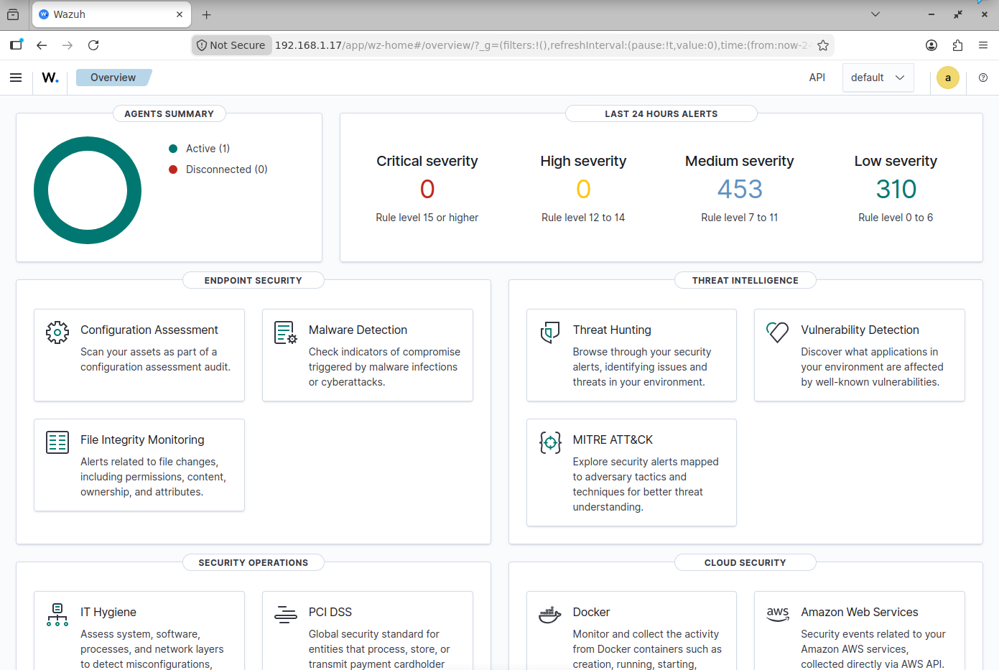

---

### 3. Install the Wazuh Agent on Windows

Download the latest MSI installer from the [official Wazuh documentation](https://documentation.wazuh.com/current/installation-guide/wazuh-agent/wazuh-agent-package-windows.html) and install it with default settings.

---

### 4. Register the Agent with the Manager

**On Ubuntu, add the agent:**
```bash
sudo /var/ossec/bin/manage_agents
```

Select `A` to add a new agent, assign it a name and IP, then confirm.

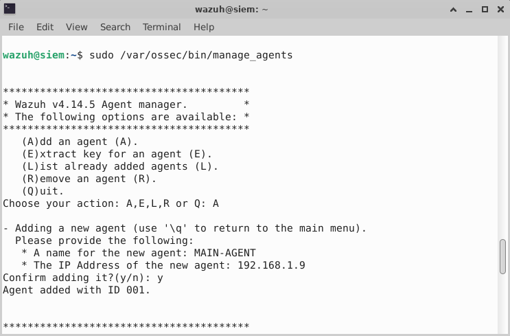

Back at the main menu, select `E` to extract the authentication key for the agent. Copy the key output.

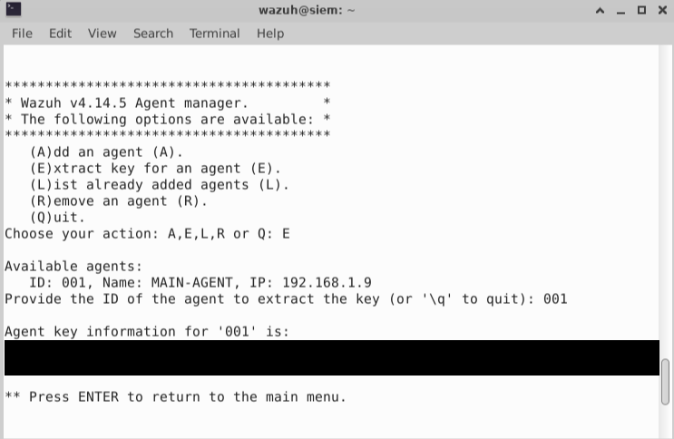

**On Windows, apply the key:**

Open **Wazuh Agent Manager** from the Start Menu, enter the Ubuntu VM's IP as the Manager IP, paste the copied key, then save and restart the agent service.

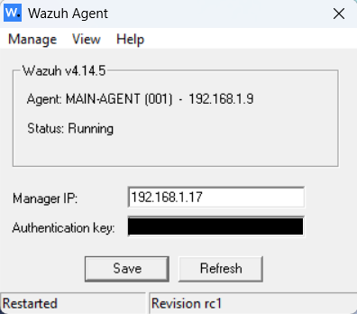

---

### 5. Configure File Integrity Monitoring

Wazuh's **Syscheck** module monitors file and folder changes in real time.

On Windows, open the agent configuration file as Administrator:
```
C:\Program Files (x86)\ossec-agent\ossec.conf
```

Add the following inside the `<syscheck>` block, pointing to a folder to monitor:
```xml
<directories realtime="yes">C:\Users\YourUser\Desktop\Test</directories>
```

Save the file and restart the Wazuh Agent service to apply the change.

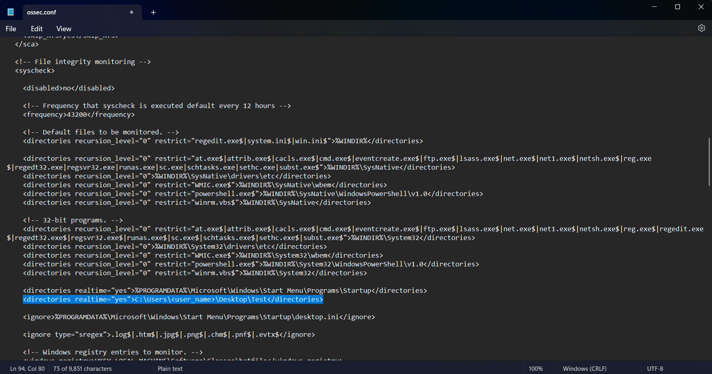

---

### 6. Set Up the Windows 11 VM (Attack Simulation Endpoint)

Installed the Wazuh agent and registered it with the manager using the same process as steps 3 and 4. Agent name used throughout the rest of this lab: **win-lab**.

**Install Sysmon** for high-fidelity process telemetry, using the SwiftOnSecurity baseline config:

```powershell
mkdir C:\sysmon; cd C:\sysmon
Invoke-WebRequest -Uri "https://download.sysinternals.com/files/Sysmon.zip" -OutFile "Sysmon.zip"
Expand-Archive .\Sysmon.zip -DestinationPath . -Force
Invoke-WebRequest -Uri "https://raw.githubusercontent.com/SwiftOnSecurity/sysmon-config/master/sysmonconfig-export.xml" -OutFile "sysmonconfig.xml"
.\Sysmon64.exe -accepteula -i sysmonconfig.xml
```

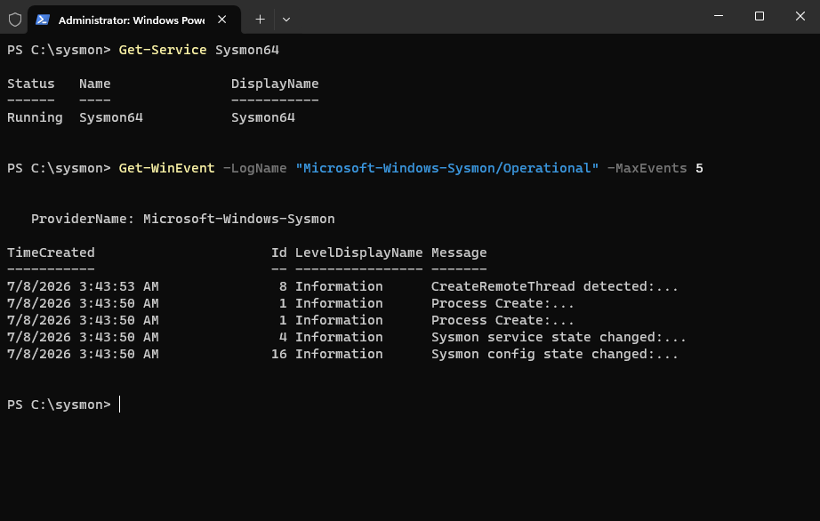

**Forward Sysmon logs to Wazuh.** Edit `C:\Program Files (x86)\ossec-agent\ossec.conf` on the Windows 11 VM and add inside `<ossec_config>`:

```xml
<localfile>
  <location>Microsoft-Windows-Sysmon/Operational</location>
  <log_format>eventchannel</log_format>
</localfile>
```

Restart the agent service. Verified in **Wazuh Dashboard → Threat Hunting**:

```
data.win.system.providerName: "Microsoft-Windows-Sysmon"
```

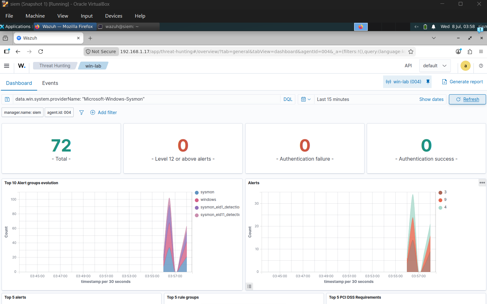

---

### 7. Generate Attack Telemetry with Atomic Red Team

Installed Atomic Red Team on the Windows 11 VM (a VirtualBox snapshot was taken beforehand):

```powershell
Set-ExecutionPolicy Bypass -Scope Process -Force
IEX (IWR 'https://raw.githubusercontent.com/redcanaryco/invoke-atomicredteam/master/install-atomicredteam.ps1' -UseBasicParsing)
Install-AtomicRedTeam -getAtomics
Add-MpPreference -ExclusionPath "C:\AtomicRedTeam"
Import-Module "C:\AtomicRedTeam\invoke-atomicredteam\Invoke-AtomicRedTeam.psd1" -Force
```

Ran **T1033, System Owner/User Discovery**:

```powershell
Invoke-AtomicTest T1033 -TestNumbers 1
```

This executes `whoami`, logged by Sysmon as a process-creation event and forwarded to Wazuh.

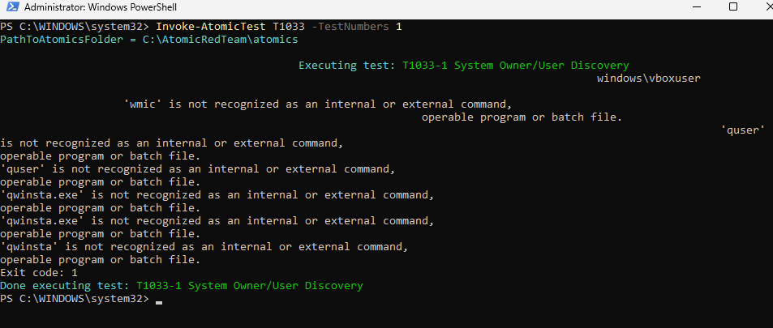

---

### 8. Write a Custom Detection Rule + MITRE ATT&CK Mapping

Custom rule added on the Ubuntu manager at `/var/ossec/etc/rules/local_rules.xml`:

```xml
<group name="local,sysmon,discovery,">
  <rule id="100010" level="10">
    <if_group>sysmon_event1</if_group>
    <field name="win.eventdata.image" type="pcre2">(?i)\\whoami\.exe</field>
    <description>Discovery: whoami.exe executed - possible System Owner/User Discovery (T1033)</description>
    <mitre>
      <id>T1033</id>
    </mitre>
  </rule>
</group>
```

```bash
sudo systemctl restart wazuh-manager
```

The rule fires on Sysmon Event ID 1 when `whoami.exe` executes and is tagged with MITRE technique **T1033**. Confirmed in Threat Hunting (`rule.id: 100010`) and in the MITRE ATT&CK module.

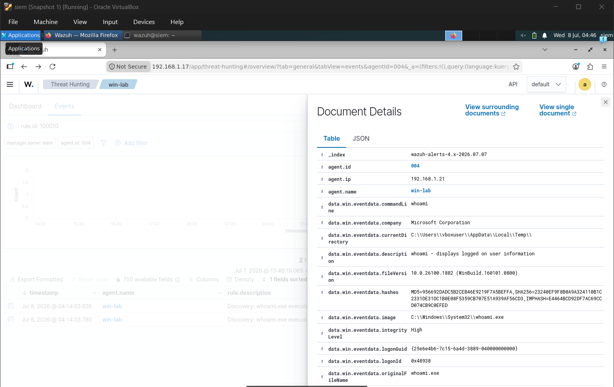
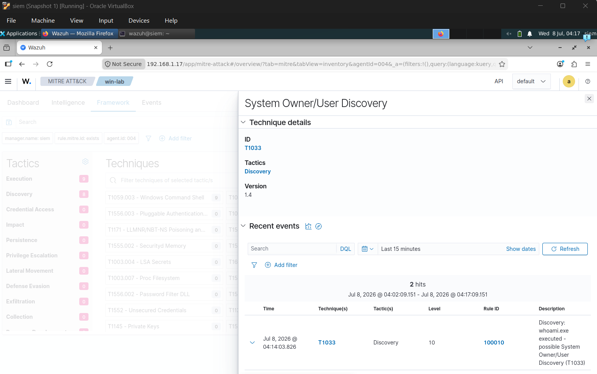

---

### 9. Enable Native Vulnerability Detection

Wazuh's Vulnerability Detection module compares each agent's installed software (collected by Syscollector) against CVE feeds directly in the SIEM, no separate scanner required.

Confirmed enabled on the manager (`/var/ossec/etc/ossec.conf`):

```xml
<vulnerability-detection>
  <enabled>yes</enabled>
  <index-status>yes</index-status>
  <feed-update-interval>60m</feed-update-interval>
</vulnerability-detection>
```

Shortened the Syscollector interval on the Windows 11 VM agent config for faster results:

```xml
<wodle name="syscollector">
  <disabled>no</disabled>
  <interval>10m</interval>
  <scan_on_start>yes</scan_on_start>
  <packages>yes</packages>
  <hotfixes>yes</hotfixes>
</wodle>
```

Results in **Vulnerability Detection → Inventory** for agent `win-lab`: 298 CVEs found, including multiple Critical severity findings (for example CVE-2026-47291 and CVE-2026-45657).

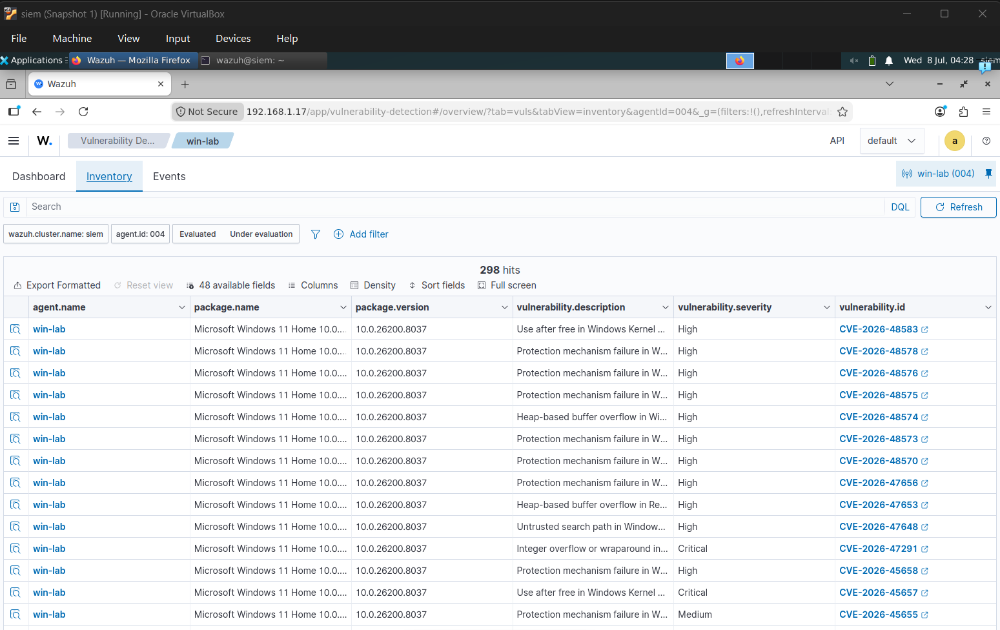

---

### 10. Correlate Vulnerabilities with Detections

Pivoted from the T1033 detection (rule 100010, agent `win-lab`) to that same agent's vulnerability inventory to assess risk in context rather than in isolation.

**Finding:** win-lab shows System Owner/User Discovery (T1033) activity via `whoami.exe`, and carries Critical, network-exploitable, unauthenticated CVEs (CVE-2026-47291: AV:N/AC:L/PR:N/UI:N). Discovery activity on a host with this exposure is treated as elevated priority for investigation.

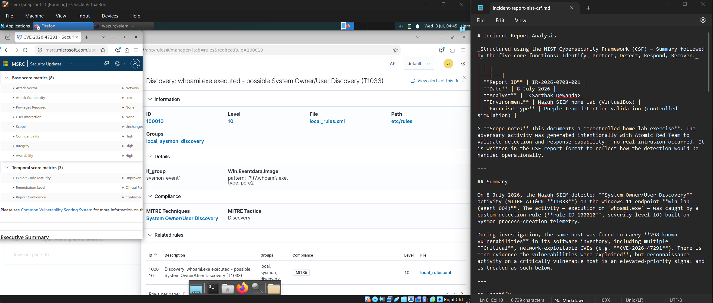

---

### 11. Incident Report (NIST CSF)

Full incident report written using the NIST Cybersecurity Framework 2.0 structure (Govern, Identify, Protect, Detect, Respond, Recover), covering the T1033 detection, the affected asset, the vulnerability correlation, and remediation steps.

📄 [`incident-report-nist-csf.md`](incident-report-nist-csf.md)

---

## Resources

- [Wazuh Official Documentation](https://documentation.wazuh.com)
- [Wazuh GitHub Repository](https://github.com/wazuh/wazuh)
- [Atomic Red Team](https://github.com/redcanaryco/atomic-red-team)
- [MITRE ATT&CK Framework](https://attack.mitre.org)
- [NIST Cybersecurity Framework](https://www.nist.gov/cyberframework)
- [VirtualBox Download](https://www.virtualbox.org/wiki/Downloads)
- [Ubuntu Server Download](https://ubuntu.com/download/server)
