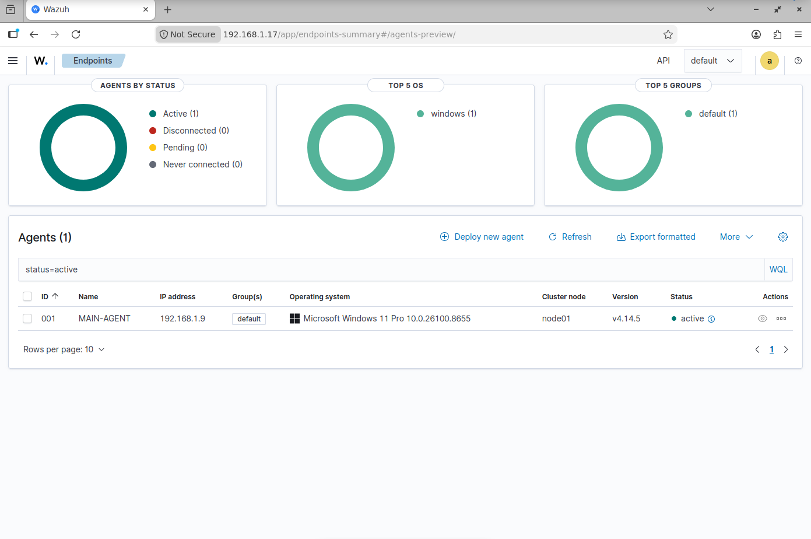
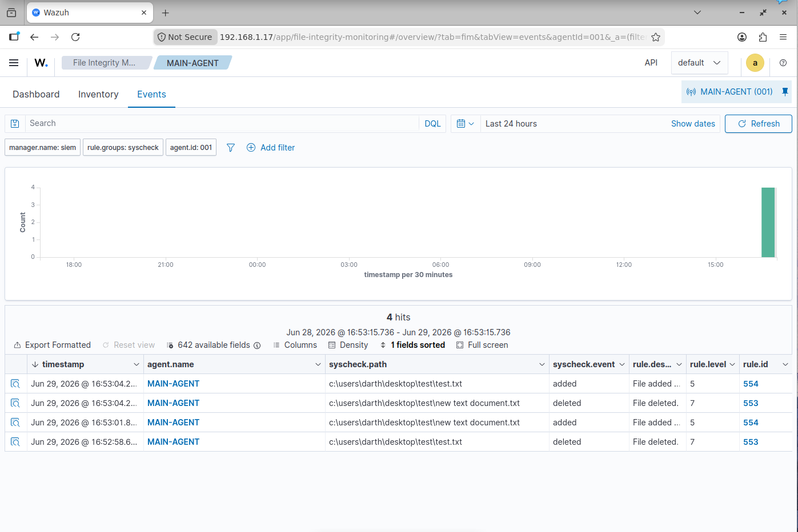

# Wazuh SIEM Home Lab — Security Monitoring & File Integrity

A home lab project demonstrating the deployment of Wazuh as a SIEM (Security Information and Event Management) platform. Covers manager setup on Ubuntu, Windows agent registration, and real-time File Integrity Monitoring (FIM).

---

## 📑 Table of Contents

- [Overview](#overview)
- [Lab Architecture](#lab-architecture)
- [Prerequisites](#prerequisites)
- [Setup](#setup)
  - [1. Install Wazuh Manager on Ubuntu](#1-install-wazuh-manager-on-ubuntu)
  - [2. Access the Wazuh Dashboard](#2-access-the-wazuh-dashboard)
  - [3. Install the Wazuh Agent on Windows](#3-install-the-wazuh-agent-on-windows)
  - [4. Register the Agent with the Manager](#4-register-the-agent-with-the-manager)
  - [5. Configure File Integrity Monitoring](#5-configure-file-integrity-monitoring)
- [Verifying the Setup](#verifying-the-setup)
- [Resources](#resources)

---

## Overview

Wazuh is a free, open-source security platform used in enterprise environments for threat detection and compliance monitoring. This lab builds a working SIEM from scratch to practice:

- Log collection and analysis
- Agent-manager communication
- Real-time File Integrity Monitoring (FIM) using Wazuh's Syscheck module
- Security alert investigation via the Wazuh Dashboard

---

## Lab Architecture

```
     ┌─────────────────────────────────┐
     │         Ubuntu VM               │
     │    Wazuh Manager + Dashboard    │
     │       (VirtualBox — Bridged)    │
     └────────────────┬────────────────┘
                      │
            Bridged Network Adapter
                      │
     ┌────────────────┴────────────────┐
     │         Windows Host            │
     │         Wazuh Agent             │
     └─────────────────────────────────┘

  Windows Agent ──▶ Sends logs & events ──▶ Wazuh Manager
  Wazuh Manager ──▶ Analyzes & displays  ──▶ Dashboard
```

| Component      | Host                    | Role                                          |
|----------------|-------------------------|-----------------------------------------------|
| Wazuh Manager  | Ubuntu VM (VirtualBox)  | Collects, analyzes, and stores agent data     |
| Wazuh Agent    | Windows (host machine)  | Sends logs and system events to the manager   |

> **Network:** VirtualBox set to **Bridged Adapter** so Ubuntu and Windows share the same local network.

---

## Prerequisites

- VirtualBox installed
- Ubuntu Server 20.04+ running in VirtualBox (bridged networking)
- Internet access on the Ubuntu VM
- Administrator access on Windows

---

## Setup

### 1. Install Wazuh Manager on Ubuntu

Run these commands on your Ubuntu VM.

**Add the Wazuh GPG key:**
```bash
curl -s https://packages.wazuh.com/key/GPG-KEY-WAZUH | sudo gpg --dearmor -o /usr/share/keyrings/wazuh-archive-keyring.gpg
```

**Download and run the installation script:**
```bash
curl -sO https://packages.wazuh.com/4.xx/wazuh-install.sh && sudo bash ./wazuh-install.sh -a -i
```

- `-a` — installs all components (manager, indexer, dashboard)
- `-i` — runs in interactive mode

Installation takes approximately 20–30 minutes. The dashboard credentials are displayed at the end of the script — **save them**.

---

### 2. Access the Wazuh Dashboard

Get the Ubuntu VM's IP:
```bash
ifconfig
```

Open a browser and navigate to:
```
https://<ubuntu-vm-ip>
```

Accept the self-signed certificate warning and log in with the credentials from the install script.


---

### 3. Install the Wazuh Agent on Windows

Download the latest MSI installer from the [official Wazuh documentation](https://documentation.wazuh.com/current/installation-guide/wazuh-agent/wazuh-agent-package-windows.html) and install it with default settings.

---

### 4. Register the Agent with the Manager

**On Ubuntu — add the agent:**
```bash
sudo /var/ossec/bin/manage_agents
```

Select `A` to add a new agent, assign it a name and IP, then confirm.


Back at the main menu, select `E` to extract the authentication key for the agent. Copy the key output.


**On Windows — apply the key:**

Open **Wazuh Agent Manager** from the Start Menu, enter the Ubuntu VM's IP as the Manager IP, paste the copied key, then save and restart the agent service.


---

### 5. Configure File Integrity Monitoring

Wazuh's **Syscheck** module monitors file and folder changes in real time.

On Windows, open the agent configuration file as Administrator:
```
C:\Program Files (x86)\ossec-agent\ossec.conf
```

Add the following inside the `<syscheck>` block, pointing to a folder you want to monitor:
```xml
<directories realtime="yes">C:\Users\YourUser\Desktop\Test</directories>
```

Save the file and restart the Wazuh Agent service to apply the change.


---

## Verifying the Setup

Navigate to **Endpoints** in the Wazuh Dashboard and confirm the Windows agent status is **Active**.



Go to **File Integrity Monitoring → Events**, then create, modify, or delete a file inside the monitored folder. Alerts appear in the dashboard in real time.



---

## Resources

- [Wazuh Official Documentation](https://documentation.wazuh.com)
- [Wazuh GitHub Repository](https://github.com/wazuh/wazuh)
- [VirtualBox Download](https://www.virtualbox.org/wiki/Downloads)
- [Ubuntu Server Download](https://ubuntu.com/download/server)
